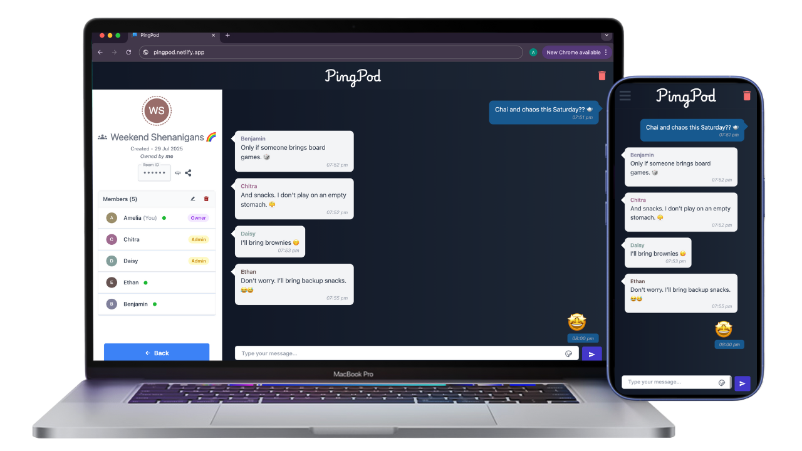

# Pingpod Client

The frontend of **Pingpod** — a responsive, real-time chat application with a room-based messaging system. Built using React and modern UI libraries, it connects seamlessly to the backend powered by Spring Boot and WebSocket.

Crafted with a focus on clean UI, state management, and real-time interaction.

---

---

## ⚙️ Features

- Join, create, and manage **chat rooms**
- Real-time messaging via **WebSocket integration**
- Responsive UI for mobile and desktop
- View room info, participants, and room metadata
- Role-based room controls (admin privileges)
- Auth flows with **cookie-based session management**

---

## 🛠 Tech Stack

- **Frontend**: React
- **State Management**: Redux Toolkit
- **Styling**: Tailwind CSS + Material UI
- **Communication**: Axios (REST) + WebSocket
- **Backend**: Spring Boot (via `pingpod-backend`)

---

## 🔗 Repositories

- **Backend Repository**: [Pingpod Backend Repository](https://github.com/thealkeshgupta/pingpod-server.git)
- **Live App**: [https://pingpod.netlify.app/](https://pingpod.netlify.app/)

---

## 📁 About the Project

Pingpod’s frontend focuses on delivering a smooth user experience, responsive layout, and real-time feedback using modern frontend libraries and state tools. It serves as a showcase of practical frontend architecture in a full-stack environment.

---

## 📄 License

MIT License © Alkesh Gupta
